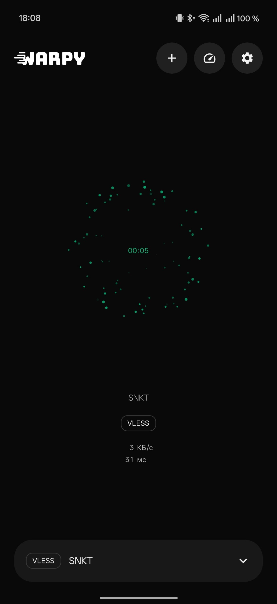
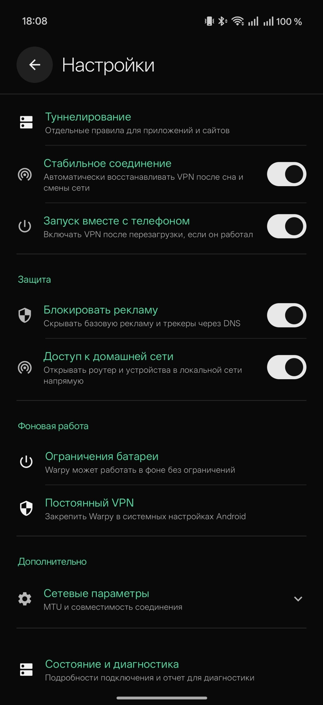
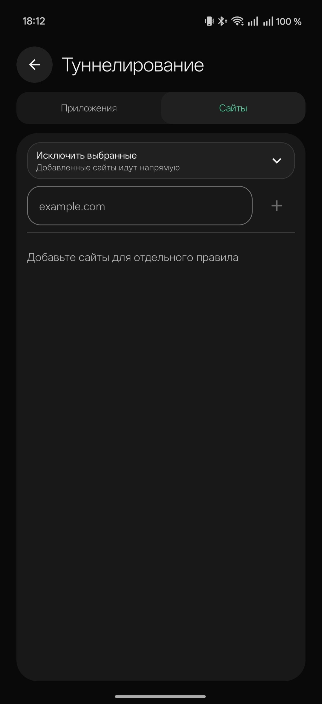
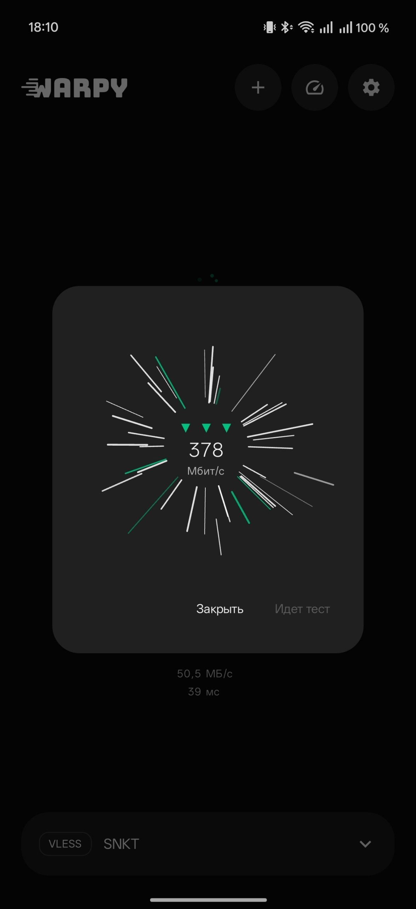

<p align="center">
  
</p>

<p align="center">
  <strong>У меня очень плохо вел себя Телеграм с другими клиентами, мне это надоело, пришлось сделать свой VPN-клиент для Android и Windows с автоматическим распознаванием профилей, раздельным туннелированием и восстановлением соединения. Пользуйтесь.</strong>
</p>

<p align="center">
  <a href="https://github.com/senkatto/Warpy/releases">Скачать</a>
  &nbsp;&middot;&nbsp;
  <a href="#быстрый-старт">Быстрый старт</a>
  &nbsp;&middot;&nbsp;
  <a href="#возможности">Возможности</a>
  &nbsp;&middot;&nbsp;
  <a href="./SECURITY.md">Безопасность</a>
</p>

Warpy импортирует VPN-профили, создаёт системный туннель и показывает подключение
только после подтверждённого обмена трафиком.
Профили хранятся на устройстве и не отправляются в облако Warpy.

> **Warpy не продаёт VPN-доступ и не выдаёт серверы.** Для подключения нужен совместимый
> профиль от вашего провайдера или собственного сервера.

## Интерфейс

<p align="center">
  <a href="./assets/readme/android-connection.jpg"></a>
  &nbsp;
  <a href="./assets/readme/android-settings.jpg"></a>
  &nbsp;
  <a href="./assets/readme/android-tunneling.jpg"></a>
  &nbsp;
  <a href="./assets/readme/android-speed-test.jpg"></a>
</p>

## Возможности

### Девять протоколов без ручного выбора

`VLESS` · `Hysteria2` · `Hysteria` · `Trojan` · `VMess` · `Shadowsocks` · `SOCKS` · `WireGuard` · `TUIC` · `Naive`

Warpy распознаёт протокол по содержимому ссылки. На Android профиль можно добавить из буфера обмена,
QR-кода или изображения с QR-кодом; на Windows - из буфера обмена. Ссылки подписок распознаются той же
кнопкой, поэтому перед импортом не нужно выбирать тип профиля.

| | Android | Windows |
| --- | --- | --- |
| **Протоколы** | VLESS, Hysteria2, Hysteria, Trojan, VMess, Shadowsocks, SOCKS, WireGuard, TUIC, Naive | VLESS, Hysteria2, Hysteria, Trojan, VMess, Shadowsocks, SOCKS, WireGuard, TUIC, Naive |
| **Импорт** | Ссылка, буфер обмена, QR-код и подписка | Ссылка, буфер обмена и подписка |
| **Туннелирование** | Отдельные правила для приложений и сайтов | Отдельные правила для приложений и сайтов |
| **Надёжность** | Проверка трафика, восстановление после сна и смены сети | Проверка трафика и восстановление через системную службу |
| **Управление** | Быстрая плитка, уведомление и постоянный VPN | Компактное окно и системный трей |
| **Хранение** | Зашифрованные локальные настройки | Windows DPAPI для текущего пользователя |

### Профили остаются вашими

- Для работы не нужен аккаунт Warpy.
- Профили не синхронизируются через стороннее облако.
- Можно импортировать отдельную ссылку или подписку с несколькими профилями.
- Удаление или добавление неактивного профиля не перезапускает действующее подключение.

### Трафик под вашим контролем

- Приложения и сайты можно включать в VPN или отправлять напрямую.
- Доступ к домашней сети позволяет открывать роутер и локальные устройства без VPN.
- Блокировка интернета при обрыве не даёт трафику незаметно уйти в обычную сеть.
- Базовая DNS-фильтрация скрывает известную рекламу и трекеры.

### Соединение проверяется, а не угадывается

- Warpy сообщает о подключении после подтверждённого обмена трафиком.
- Актуальная сессия восстанавливается после сна, перезапуска и смены сети.
- MTU и режим совместимости с QUIC доступны в сетевых параметрах.
- Диагностика показывает состояние туннеля без отправки отчёта разработчику.

## Быстрый старт

1. Получите ссылку VPN-профиля у провайдера либо со своего сервера.
2. Скопируйте ссылку и нажмите кнопку добавления профиля либо отсканируйте QR-код на Android.
3. Warpy сам определит протокол и добавит профиль без дополнительного выбора.

Готовые установщики находятся в [GitHub Releases](https://github.com/senkatto/Warpy/releases).

### Системные требования

- **Android:** Android 8.0 или новее, устройство `arm64-v8a`.
- **Windows:** Windows 10 или новее, x64 и Microsoft Edge WebView2 Runtime.

## Конфиденциальность и безопасность

- В Warpy нет аналитики, аккаунтов и облачного хранилища профилей.
- Android хранит чувствительные настройки в зашифрованном хранилище.
- Windows защищает сохранённые данные через DPAPI текущего пользователя.
- Диагностические данные остаются на устройстве, пока пользователь сам их не скопирует.
- Временная конфигурация удаляется после запуска там, где это допускает платформа.

О найденной уязвимости сообщайте по инструкции в [SECURITY.md](SECURITY.md). Не публикуйте
рабочие ссылки, UUID, пароли, ключи и полные журналы подключения в открытых задачах.

<details>
<summary><strong>Ограничения</strong></summary>

- DNS-фильтрация не удаляет рекламу, которая приходит с того же домена, что и содержимое.
- Hysteria2 требует доступного UDP/QUIC в текущей сети.
- Некоторые прошивки Android ограничивают фоновые VPN-службы. На таких устройствах рекомендуется
  отключить ограничения батареи и включить системный режим постоянного VPN.
- Установщик Windows пока не подписан Authenticode, поэтому SmartScreen может показать предупреждение.

</details>

## Разработка

```text
app/             Android: Kotlin, Jetpack Compose, VpnService, libbox
desktop-tauri/   Windows: Tauri 2, Rust, sing-box, Wintun
tools/adb/       Проверки на физическом Android-устройстве
docs/            Выпуск, тестирование и автоматизация
```

<details>
<summary><strong>Проверка Android</strong></summary>

Требуются Java 17 и Gradle Wrapper.

```powershell
.\gradlew.bat :app:checkMojibakeText :app:testProductionUnitTest :app:lintProduction
```

Производственная подпись и выпуск описаны в [docs/GITHUB_RELEASE.md](docs/GITHUB_RELEASE.md).

</details>

<details>
<summary><strong>Проверка Windows</strong></summary>

```powershell
cd desktop-tauri
npm ci
npm test
npm audit --omit=dev
cargo fmt --manifest-path src-tauri\Cargo.toml -- --check
cargo clippy --manifest-path src-tauri\Cargo.toml --all-targets -- -D warnings
cargo test --manifest-path src-tauri\Cargo.toml --all-targets
.\scripts\verify-core-provenance.ps1
```

</details>

Правила участия находятся в [CONTRIBUTING.md](CONTRIBUTING.md), матрица автоматических проверок -
в [docs/AUTOMATED_TESTING.md](docs/AUTOMATED_TESTING.md).

## Лицензия

Warpy распространяется по лицензии [GNU GPL версии 3 или новее](LICENSE).
Условия и исходники встроенных VPN-компонентов перечислены в
[THIRD_PARTY_NOTICES.md](THIRD_PARTY_NOTICES.md).

---

<div align="center">
  <h3>Поддержать автора</h3>
  <p><strong>Т-Банк</strong></p>
  <p><code>4377723774967651</code></p>
</div>
